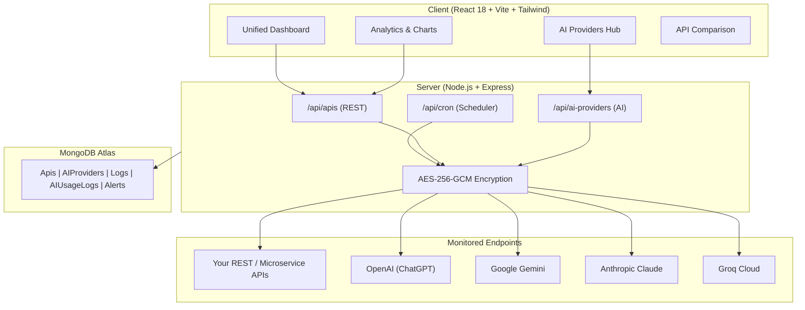

<div align="center">

  # ⚡ API Health & Performance Monitor
  ### Production-Grade Full-Stack Observability & AI Provider Monitoring

  <p align="center">
    <a href="https://api-health-performance-monitor-omega.vercel.app/">
      
    </a>
    <a href="https://github.com/Dharani94873/API-Health-Performance-Monitor">
      
    </a>
  </p>

  <p align="center">
    
  </p>

  <p align="center">
    
    
    
    
    
    
    
  </p>

</div>

---

## 🌟 Overview

**API Health & Performance Monitor** is a modern, enterprise-grade observability platform designed for developers and DevOps teams. It monitors both **standard REST/GraphQL APIs** and **AI/LLM Providers (OpenAI, Gemini, Anthropic, Groq, OpenRouter)** with sub-second precision, uptime tracking, latency percentiles (P95/P99), rate-limit header parsing, and instant alerts.

Everything is packed into a glassmorphism dark-mode UI with interactive charts, multi-endpoint comparison, and single-click automated Vercel deployment.

---

## 🚀 Key Modules & Capabilities

### 🤖 AI Provider Monitoring (New!)
- **Zero-Token Health Checks**: Performs lightweight models-list checks (`GET /v1/models` for OpenAI, `/v1beta/models` for Gemini, etc.) that monitor endpoint availability **without consuming paid tokens**.
- **Multi-Provider Adapters**:
  - 🟢 **OpenAI**: Health, RPM/TPM rate limits, and Org Usage & Costs API.
  - 🔵 **Google Gemini**: Models list health & token metadata parsing.
  - 🟣 **Anthropic**: Functional minimal message test & Anthropic rate limit headers.
  - 🟠 **Groq**: High-speed inference latency & RPM/TPM header tracking.
  - 🌐 **OpenRouter & Custom**: Generic endpoints with custom headers and body templates.
- **Dedicated Health Scoring**: Algorithmic 0–100 health grades (`A+` to `F`) factoring in uptime %, latency standard deviation, and error rates.

### 📡 Core API Monitoring
- **Multi-Method Support**: `GET`, `POST`, `PUT`, `PATCH`, `DELETE`, `HEAD`, `OPTIONS`.
- **Flexible Auth**: API Keys, Bearer Tokens, Basic Auth, and Custom Header injections (stored encrypted).
- **Automated Scheduling**: Cron scheduling every 1–60 minutes, paired with serverless cron fallback for Vercel.
- **SSL Certificate Tracking**: Real-time SSL expiry checks with 30-day early warning alerts.
- **Rate Limit Headers**: Parses `x-ratelimit-limit`, `x-ratelimit-remaining`, and reset timers directly from responses.

### 📊 Enterprise Analytics & Dashboards
- **Unified Overview**: Real-time aggregated metrics covering both standard APIs and AI providers on one screen.
- **Performance Percentiles**: Exact `P95` and `P99` latency calculations.
- **Interactive Visualizations**: Recharts-powered area charts, latency distribution histograms, and multi-endpoint radar comparisons.
- **CSV Data Export**: One-click export for reporting and auditing.

---

## 🏛️ System Architecture



---

## 🔐 Security & Privacy

- **AES-256-GCM Authenticated Encryption**: All sensitive credentials (API keys, Bearer tokens, Admin keys) are encrypted before hitting MongoDB.
- **Zero Plaintext Leakage**: Secret keys are never returned in any API responses; only boolean flags (`hasApiKey: true`) reach the client.
- **JWT Protection**: Secure token-based authentication with bcrypt password hashing.
- **Hardened HTTP**: Protected with Helmet security headers, CORS origin restrictions, and Express rate limiting.

---

## 🛠️ Tech Stack Matrix

| Layer | Technologies |
|---|---|
| **Frontend** | React 18, Vite 5, React Router 6, Tailwind CSS 3, Recharts, React Icons, Axios |
| **Backend** | Node.js, Express 4, Mongoose 8, node-cron, Axios, Crypto |
| **Database** | MongoDB Atlas |
| **Security** | AES-256-GCM, JWT, bcryptjs, Helmet, Express Rate Limit |
| **Hosting & CI/CD** | Vercel Serverless, GitHub Actions |

---

## ⚡ Quick Start

### 1. Clone the repository
```bash
git clone https://github.com/Dharani94873/API-Health-Performance-Monitor.git
cd API-Health-Performance-Monitor
```

### 2. Configure Environment Variables

Create `server/.env`:
```env
PORT=5000
NODE_ENV=development
MONGO_URI=your_mongodb_connection_string
JWT_SECRET=your_jwt_secret_key
ENCRYPTION_KEY=your_64_character_hex_encryption_key
CLIENT_URL=http://localhost:5173
```

Create `client/.env`:
```env
VITE_API_URL=http://localhost:5000/api
```

### 3. Install & Run Locally

```bash
# Install dependencies
npm run install:all

# Run backend (Terminal 1)
npm run dev:server

# Run frontend (Terminal 2)
npm run dev:client
```

Open [http://localhost:5173](http://localhost:5173) in your browser.

---

## 🌐 Deploy to Vercel (1-Click)

The repository includes a unified `vercel.json` configured to build the Vite client and run the Express API as a serverless function automatically:

1. Push to your GitHub `main` branch.
2. Link the repository on [Vercel](https://vercel.com).
3. Add the following **Environment Variables** in Vercel Project Settings:
   - `MONGO_URI`: Your MongoDB Atlas URI
   - `JWT_SECRET`: Random 32+ character string
   - `ENCRYPTION_KEY`: (Optional) 64-char hex key (automatically falls back to `JWT_SECRET` if not provided)
4. Your site will deploy live instantly!

---

## 📜 License

Distributed under the **MIT License**. See `LICENSE` for more information.

<div align="center">
  <sub>Built with ❤️ by Dharani • Maintained for High Availability & Real-Time Observability</sub>
</div>
